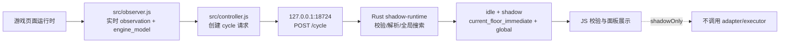
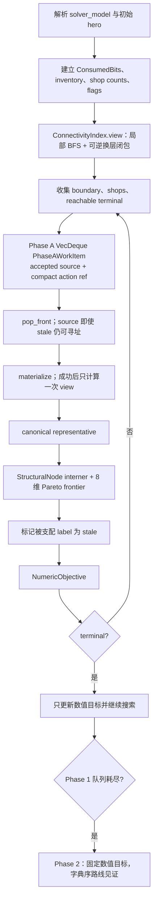

# 当前魔塔 Shadow 求解器：架构与决策技术方案

## 1. 文档定位与版本基线

本文描述仓库当前实现，而不是下一阶段目标。Rust 服务是只读 Shadow runtime：它在一次请求内解析 observation、建立求解状态、搜索有界的全局终局路线，并把证明结果或 `unproven` 状态返回给浏览器；浏览器当前强制 `shadowOnly`，不会执行路线。Rust 进程只保留进程内 cycle 计数，不持久化世界、搜索队列或路线。

`docs/solver-architecture.md`、`docs/protocol.md` 中仍有 Stage2B 的历史描述；当描述与当前代码不一致时，以 `rust/shadow-runtime/src/main.rs`、`src/observer.js` 和协议 schema 为准。本文不把未来的自动驾驶、逆向搜索或更强剪枝写成已实现能力。

## 2. 组件与运行数据流

服务只监听 `127.0.0.1`。业务入口是 `POST /cycle`；请求要求 `Content-Type: application/json`、`X-Mota-Lab: 1`、`Content-Length`，请求体上限为 9 MiB。`OPTIONS /cycle` 只为配置的 `https://h5mota.com` 提供严格预检。`shadow_response` 返回 `status: idle`，`shadow.mode: read_only`，并把 `cycle` 计数、当前 observation 身份和分析结果放入响应。未知请求、非法 JSON、来源、Origin 或 header 失败时返回错误，不生成执行包。

## 3. 输入与静态世界模型

浏览器采集当前 hero、钥匙、位置、忙闲状态、当前楼层 blocks，以及可选的完整 `engine_model`。`collectEngineModel` 从引擎的 floors/status maps、blocksInfo、items、enemies、values、inventory 建立结构化模型，并缓存静态来源；动态地图可使用压缩表示，`decodeDetachedDynamicMap` 把整行 `0` 或单格 `-1` 从定义地图继承，形状或 token 不合法就暂停。

求解器看到的是 `solver_model`，而不是原始 JavaScript。每层包含 `floor_id`、宽高、`rectangle` 或 `valid_cells` 拓扑，以及 blocks。`buildSolverModel` 将 block 投影为 `terrain`、`door`、`enemy`、`resource`、`shop`、`transition`、`event` 或 `opaque`；楼梯目标由 `change_floor` 和目标楼层落点归一化，无法确定时成为 blocker。终局来自检测到的 `win` 事件位置，支持一个位置或最多 32 个 `any_location` 位置。24 层、每层 13×13（169 格、合计约 4056 格）是 games/24 的输入例子，不是求解器的固定层数；schema 允许更大的有限模型。

事件不是通用脚本解释器。普通运行时事件只保留坐标和 `event_script` blocker；只有 `auditedSolverEvent` 中登记的有限 ID 才投影成可模拟事件。商店同样先由 `parseRestrictedShop` 校验为受限、可递增计数的结构，再进入 solver model。存在任一 blocker 时，global 分析直接返回 `unsupported_solver_blocker`，避免猜测脚本语义。

## 4. 搜索状态与共享数据

Phase A 将完整 `SolverState` 显式拆成 interned `StructuralNode` 与 `ResourceLabel`。前者是未来动作/目标的完整结构身份：归一化后的 `floor/x/y`、`inventory`、`ConsumedBits`、`shop_counts`、`level` 和 `flags`；后者只有 `hp/attack/defense`（有限 `f64`）、`gold`、`experience` 与三色钥匙。钥匙不重复放进结构身份。每个 `StructuralNode` 在该次 Phase A 搜索中只存一次，label 以结构 ID 引用它。

`inventory`、`flags`、`shop_counts` 和位图仍以 `Arc` 共享，写入时使用 copy-on-write；仅在 materialize 一个动作时临时重建完整 `SolverState`，随后再拆回结构和资源。`ConsumedBits` 只为门、敌人、资源、事件、初始 inactive block 和审计事件目标分配状态槽；一次真实 50k 测量得到 754 个槽，位图是 12 个 `u64`（`af5b511`）。静态 floors、blocks、shop 定义不属于节点。hero 的方向、捕获时间、原始 damage 证据也不是策略状态；damage 只在 observation 采集或敌人模拟时使用。

## 5. 轻量全局联通

`ConnectivityIndex` 预先保存每层有效格和每格 block 索引，并为每个 transition 检查“纯、激活、非自环、唯一且互相可逆”的伙伴。只有满足这些条件的换层才是免费导航边；单向、inactive、带额外字段（副作用）或无法唯一配对的换层保留为战略 boundary。

对每个搜索状态，`view` 从当前位置做局部 BFS：未消耗的非 `terrain`、非 `shop` block 阻断格子；门、敌人、资源、事件和战略换层停在边界。发现可逆楼梯后，会进入目标楼层并重算局部 BFS。组件用 `(floor, 最小可达格索引)` 去重，因而 floor 只是坐标命名空间，不是策略阶段。第一阶段不记录 transition 序列；只有路线见证阶段才重新计算并保留 navigation witness，远端楼层的候选仍可直接入队。

动态门、事件替换或激活会改变 `ConsumedBits`/flags；下一状态会重新计算闭包，不复用过时的可达区域。对应 transition 的移动步骤仍写入 route witness/最终 route；系统没有独立的移动代价模型，也不制造一个“只是在第 N 层”的战略状态。

## 6. 决策生成流程

Phase A 是 FIFO 的 bounded label-setting search：`VecDeque<PhaseAWorkItem>` 按 work item 的入队顺序取出，不按启发式优先级排序。每个 work item 只保存 accepted source label 与 compact action ref；pop 时 source 即便已 stale 仍可从 append-only arena 寻址。随后 materialize 该动作并只计算一次完整 `ConnectivityIndex::view`；无效钥匙、资源、战斗、商店或未支持事件返回 `None`，不会产生后继。动作资源可行性始终从 label 的实时资源检查，未写入结构缓存。

Phase A 的 action ref 只有带 tag 的稳定 block/shop 索引、shop choice、shop tile 索引和相邻 cell，不能保留 navigation、String 或完整状态。初始 accepted source 计算一次 `view`，用其中 representative canonicalize/Pareto 后按 boundary、shop、choice 的原顺序入队；以后每个 FIFO work item 在真正 pop 时才 materialize。成功后复用这次 view 的 representative 做 canonicalize/Pareto、终局判断和后继入队，拒绝后立即丢弃该 view；代表 BFS 热路径为 0。新 label 支配旧 label 时旧 label 虽标记 stale，已入队 work item 仍可从 append-only arena 取回 source 并保持 FIFO 语义。第 `max_states` 个 accepted/expanded label 计入预算后，queue 空返回 Complete，否则返回 BudgetExhausted；不会 materialize 下一个 candidate。终局只更新 `NumericObjective`。候选包括所有可达 boundary（door、enemy、resource、event、战略 transition）以及可达受限商店的每个 choice；当前楼层的 `current_floor_immediate` 分析是同一响应中的独立即时 BFS，最多返回 256 个候选。

## 7. 当前动作模型与 fail-closed 边界

- **战斗**：只接受有 hp/attack/defense/gold/experience 且无 special 的敌人；按英雄攻击减敌防计算回合数和战损，致死动作被拒绝。
- **门**：支持三色钥匙成本和可审计的 inventory 成本（如 special key）；扣费后消费 block。
- **资源**：支持三色钥匙、`bigKey`、`centerFly`、`superPotion`、`skill1`、`wand` 等已审计 item，以及受限的 `itemEffect` 数字增量语法；未知 item effect 形成 blocker。
- **商店**：支持经验商店、钥匙商店及通过固定表达式验证的 gold 属性商店；每个 choice 的购买次数在状态中独立递增，价格按模型计算。
- **事件**：覆盖 `fairy_mt0`、奖励/交易、`thief_quest`、`princess_quest`、`wand_gate_*`、一次性对白等审计 ID，并可激活、消费或替换指定 block。任何未登记事件、未知怪物 special、未知楼梯落点或不完整终局都 fail closed。

## 8. 目标函数与终局比较

终局比较拆为两个严格阶段。Phase 1 到达任一终局坐标时只记录 `NumericObjective`，搜索仍会继续以寻找更优数值。该目标顺序是：

1. `attack + defense` 最大；
2. `min(attack, defense)` 最大，用于偏好攻防均衡；
3. 终局 `hp` 最大；

Phase 1 队列耗尽后，才启动独立、同预算上限的 Phase 2。Phase 1 由 `run_numeric_proof` 独占 work-item queue、结构/label arena 与 Pareto frontier；函数返回的 `PhaseAResult` 只含数值目标、完成状态和 explored 数，因而这些大对象已确定性释放，不能与 Phase 2 的 witness 队列叠加。Phase 2 将数值目标固定为 Phase 1 的最优三元组，重新计算 connectivity/navigation，并以 typed `RouteStepKey` 的最小堆展开。

`RouteStepKey` 覆盖 door/resource/enemy/transition/event/shop/terminal 的全部当前协议字段。它从同一 typed `RouteStepSemantic` 同时生成输出 `Value` 和比较 key；比较不依赖 `serde_json::Map` 的插入顺序。规范编码递归按 UTF-8 字段名排序 object，字符串与数字使用标准 JSON 标量编码，因而与本版本既有 canonical JSON 数组比较等价。为保持历史语义，两个 route 相同前缀而长度不同的时候，较长 route 更小：JSON 数组的下一字节 `,` 小于短数组结尾 `]`。这是协议级 tie-break 规则，不可替换为普通 Rust `Vec` 的“短前缀优先”。

`ConnectivityView` 收集当前闭包内的全部可达终点（按 floor/坐标/导航稳定排序），因此 Phase 2 会为每个终点构造完整候选，再以完整 typed step 序列取全局字典序最小者。canonical witness 的域明确限制为 **state-simple**：战略 `SolverState` 不得在自己的祖先链中重复；navigation 使用 `ConnectivityView` 给出的固定 BFS witness，不枚举无状态物理绕圈。在此域中，两个到达同一状态的有效前缀不能互为严格 step 前缀；对于非前缀序列，追加相同后缀保持字典序。因此同一状态只保留较小 typed prefix 是安全的。这里的 tie-break 范围是 canonical BFS navigation、全部可达终点和战略动作路线；它不枚举同一导航闭包内所有物理绕行路线。Phase 2 枚举耗尽后，从初始状态重放 block/shop/transition 段验证。Phase 2 达到预算时沿用协议合法的 `reason: search_budget_exhausted`、`truncated: true`、`route: null`；无法重放时 fail closed，返回 `unproven`、`route: null`。响应的 `explored_states` 始终是 Phase 1 数量，避免把两阶段计数混合；内部 `TwoPhaseStats` 单独记录 `phase_a_explored` 和 `phase_b_explored`，不改变 JSON schema。

金币、经验、钥匙和背包不直接进入终局评分，但会影响可达性和后续消费。找到路线不等于已证明全局最优：只有队列耗尽且没有 blocker 时才返回 `proof: proven`；达到 `search_budget`（默认最多 50,000）返回 `proof: unproven`、`reason: search_budget_exhausted`，不返回路线。

## 9. 去重与剪枝

Phase A 没有独立的 exact `HashSet<SolverState>`。同一结构节点下，`ResourceLabel` 的 eight-vector 是 Pareto frontier：若已有向量在八个维度都不小于新 label，新 label 被淘汰；相等向量由这个反身支配规则直接淘汰；若新向量全维不小于旧向量，旧 label 标记 stale 并从 frontier 移除；不可比较的向量并存。因支配关系可传递，即使旧 label 后来被删除，frontier 仍保留它的支配者。Phase B 仍有自己基于完整 `SolverState` 的 exact visited/prefix map，与 Phase A 无关。

这一剪枝依赖受支持规则的单调性假设：结构投影相同且资源更多不会减少未来合法动作或终局评分。库存、消费位、flags 和购买计数被放入 key，是为了不把“同一坐标但地图/事件状态不同”错误合并。外部方案若改变 key 或资源维度，必须给出可验证的不变量和反例测试。

## 10. 路线记录与 Shadow 边界

Phase 2 的临时节点保存 block/shop 动作及 navigation segment，以及与输出 steps 等长的 typed key；Phase 1 不保留这些数据。响应中的 route 只读描述字段可按 step 类型变化，例如包含 `step_kind`、`floor_id`、坐标和详情；block step 还带 `block_id`，shop step 还带 `shop_id`/`choice_id`。协议递归拒绝 `action`、`operation`、`guard` 等可执行字段。当前 Rust 不自动操作页面、不保存路线到磁盘；下一轮由 JS 重新采集 observation。浏览器 journal 可保存会话/恢复元数据，但不承载 Rust 搜索状态。

## 11. 性能与内存（版本区分）

旧 `d899a8f` StructuralLabel eager 调度的历史迭代曾在同类 50k 请求上出现 64.6% 的中位耗时回退；该数字仅描述那一历史版本，不代表当前惰性 FIFO。

当前惰性 compact FIFO 的归档 A/B 使用相同 request：A=`d899a8f` 中位 `4266.899 ms`、peak RSS `84,541,440 B`；B=当前 FIFO 中位 `2429.033 ms`、peak RSS `53,280,768 B`。这是单一 `PhaseB=0` 样本，不应与其他 QA 测量横向比较或宣称绝对改进。

这个性能数据只代表一个固定、Phase B 为 0 的 observation，不是所有存档的 SLA。后续 Phase A 改为惰性 compact FIFO：只在成功 candidate pop 后计算一次完整 `ConnectivityIndex::view`，不再调用独立 `representative` 热路径，也未添加 action-template/connectivity 缓存；Phase 2 在复杂且最终 `proven` 的真实世界上的额外开销仍须单独实测。

本次原始 QA 证据归档见 [`StructuralLabel rebuild QA`](qa/structural-label-rebuild-2026-07-18/README.md)；惰性 FIFO 证据见 [`lazy Phase A FIFO QA`](qa/lazy-phasea-fifo-2026-07-18/README.md)。这些仓库归档仅供审阅，不是运行时依赖。

旧路径的搜索剖析仅在 `/tmp` 的 instrumented 副本中执行，未进入交付源码：该样例曾有 394,248 次 representative BFS（合计 2.087 s）。惰性 compact FIFO 的同一 observation 临时剖析应记录 accepted/expanded/rejected/pending 和 representative 调用数；这些证据不属于运行时依赖。

历史 profile 中出现的“frontier 约 40 MiB、route/navigation 等分项”来自更早的容器快照或 bitset 之前版本；当前没有把这些旧分项相加当作 `af5b511` 的精确结构占用。已保留的优化包括 COW 状态、动态 mutable slots、Phase A 移除父链和 route arena、interned `StructuralNode`/`ResourceLabel`、compact `PhaseAWorkItem` FIFO、可逆联通索引和 `ConsumedBits`；Phase 2 只在当前请求内保存临时 route/navigation witness。曾经的 eager reversible-region 搜索已在 `bf33f0d` 回滚。

## 12. 为什么 4000 格仍会组合爆炸

格子主要描述通行拓扑；真正的搜索维度是会改变未来可行性的动作。若有 `m` 个独立的一次性资源/门/敌人，单看“已消耗子集”就有上界 `2^m`；20 个动作的二进制子集是 `1,048,576` 种。若还区分先后顺序，长度为 `k` 的序列有 `P(m,k)` 种。实际会因钥匙不足、致死战斗和重复状态而减少，但商店计数、事件 flags、战损与不同消费顺序又会拆开原本相同的子集。

例如“先吃攻 +3 再战斗”和“先战斗再吃攻”消耗同一组方块，却有不同 HP；“先用钥匙开 A 门”与“先用钥匙开 B 门”会留下不同可达区域。因此 24×169 的静态格数不是主要复杂度；50k 是当前搜索预算，而不是整个理论状态空间大小。

## 13. 已知缺口与风险

- 50k 预算可能在仍有候选时停止，结果必须显示 `unproven`，不能当作无解或全局最优。
- Phase A 的 work-item queue、结构/label arena 和 Pareto frontier 仍会随动作组合增长；Phase A 结束后会释放它们，但 Phase 2 的 route/navigation witness 当前仍为完整 `Vec` 深复制，复杂 proven 输入尚未使用 persistent parent/trie/LCP 压缩，也没有最终每类结构的稳定内存配额。
- 50k A/B 仅覆盖一个 `PhaseB=0` 的未证明请求；不同存档的时间、RSS 和 frontier 形状仍须单独测量。当前 FIFO 的归档数字不构成跨 QA 测量的绝对性能结论。
- solver model 只覆盖已审计规则子集；真实页面的动态事件、怪物 special、楼梯映射和终局投影仍需以 observation 覆盖率验证。
- Shadow 输出是路线证明/建议，不是执行授权；`main.js` 的 `shadowOnly: true` 会在任何 adapter/executor 调用前拒绝 `execute` 响应。
- 现有测试覆盖固定 fixture、协议和 Rust 单元行为；它们不证明任意真实存档都存在完整终局路线。
- Phase 2 replay 目前重放内部 segment，而不是反向解析最终 JSON 并逐格复验 navigation；它能验证已生成计划的数值目标，但还不是独立的完整 route verifier。

## 14. 给外部 AI 的评审问题

请在“不降低正确性、不引入局部贪心死档、保持全局跨层、且不采用固定 8 步窗口”的前提下评估：

1. 是否能证明更小的状态抽象/等价类，尤其是 inventory、flags、ConsumedBits 和代表位置的最小充分集合？
2. 当前八维资源 dominance 能否用安全的 DP、可证明上下界或 branch-and-bound 加强？请给反例和单调性证明。
3. AND/OR 图、资源关键点图、分层规划或关键门先验，如何在全局搜索外层保持完备性？
4. 双向/逆向搜索、symbolic/BDD、ILP/SAT 是否适合含事件副作用和商店计数的模型？边界条件是什么？
5. 对 24 层×13×13 的典型输入，请估算最坏状态数、峰值内存、单次决策时间，并说明迁移步骤。
6. 每个建议必须列出可验证不变量：终局可达性不丢失、未知规则仍 fail closed、route witness 可重放、结果确定性和预算耗尽语义不变。

不可擅自改变的约束：全塔全局规划；终局目标顺序（攻防总和、均衡度、HP、路线 tie-break）；未知脚本不猜测；不能用局部贪心或固定窗口替代证明；在用户授权前保持 Shadow-only。

## 15. 术语与代码索引

| 术语 | 代码入口 |
| --- | --- |
| observation/动态地图 | [`src/observer.js`](../src/observer.js)：`decodeDetachedDynamicMap`、`collectEngineModel`、`buildSolverModel` |
| 浏览器请求与 Shadow-only | [`src/controller.js`](../src/controller.js)：`cycleBody`；[`src/main.js`](../src/main.js)：`shadowOnly: true` |
| HTTP/响应 | [`rust/shadow-runtime/src/main.rs`](../rust/shadow-runtime/src/main.rs)：`read_request`、`handle_connection`、`shadow_response` |
| 状态/位图/去重 | 同上：`SolverState`、`StructuralNode`、`ResourceLabel`、`PhaseALabelStore`、`ConsumedBits`、`global_analysis` |
| 联通与 route witness | 同上：`ConnectivityIndex::view`、`ReachBoundary`、`ReachTerminal`、`Phase2Node`、`Phase2Route` |
| 动作模拟 | 同上：`materialize_pending_action`、`apply_audited_event`、`enemy_loss` |
| 协议约束 | [`protocol/cycle-response.schema.json`](../protocol/cycle-response.schema.json)、[`src/protocol.js`](../src/protocol.js) |
